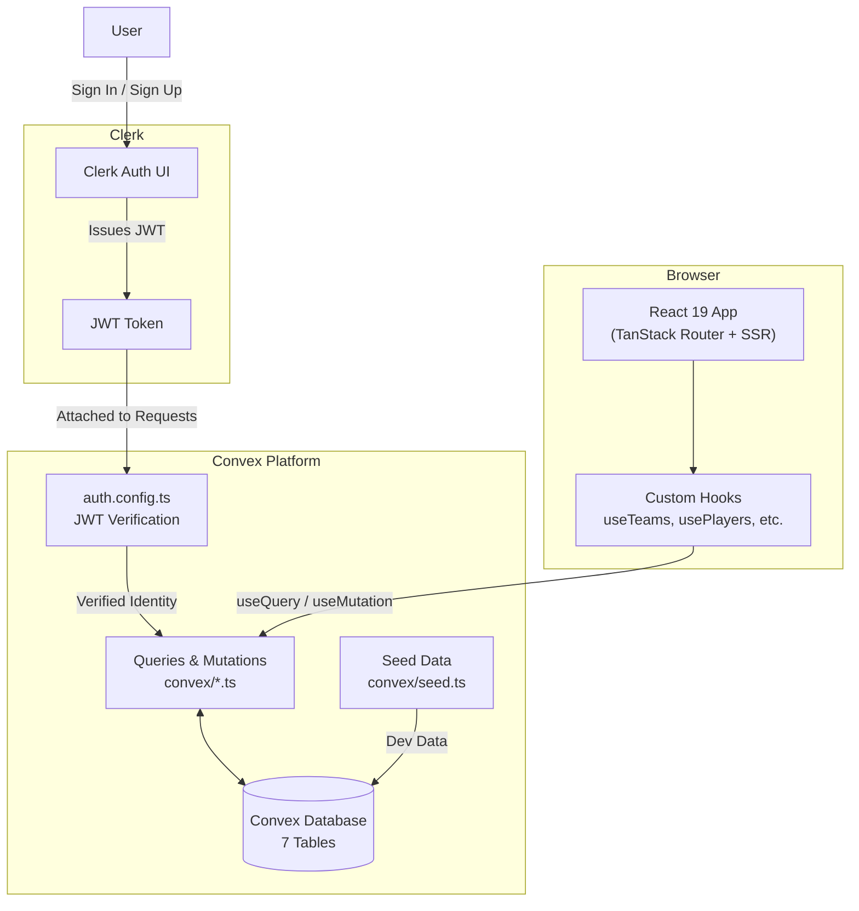
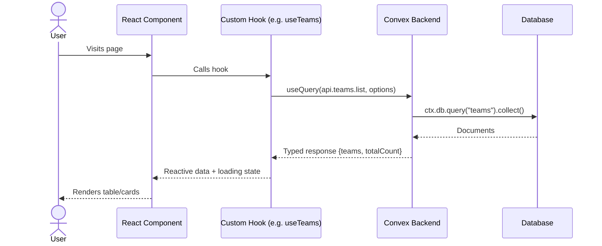

# System Architecture

## High-Level Architecture

## Data Flow

## Layer Responsibilities

### 1. Convex (Backend)
- **Database**: 7 tables (tournaments, teams, players, games, fields, gameStats, userProfiles)
- **Auth**: Validates Clerk JWT via `auth.config.ts`, manages user roles
- **Queries**: Read operations with pagination, sorting, filtering — see [`convex/`](../convex/)
- **Mutations**: Write operations with auth guards — see [`convex/`](../convex/)
- **Seed**: Development data generator — see [`convex/seed.ts`](../convex/seed.ts)

### 2. Clerk (Authentication)
- **Identity Provider**: Sign in / sign up UI, user management
- **JWT Issuance**: Issues tokens that Convex validates
- **Integration**: `ConvexProviderWithClerk` bridges Clerk auth into Convex — see [`src/integrations/convex-clerk-provider.tsx`](../src/integrations/convex-clerk-provider.tsx)

### 3. Custom Hooks (`src/hooks/`)
- Wrap Convex `useQuery` with local state for pagination/sorting/filtering
- Return reactive data + setter callbacks to components
- Consistent interface across all entities:
  - `useTeams` → `{ teams, totalCount, isLoading, setPagination, setSorting, setFiltering }`
  - `usePlayers` → `{ players, totalCount, isLoading, ... }`
  - `useGames` → `{ games, totalCount, isLoading, ... }`
  - `useTournaments` → `{ tournaments, totalCount, isLoading, ... }`

### 4. React Components (`src/components/`)
- **Pages**: Route-level components composing tables, dialogs, cards
- **DataTable**: Generic sortable/filterable/paginated table with actions
- **Dialogs**: Create/edit forms for each entity (TeamDialog, PlayerDialog, etc.)
- **Bracket**: Tournament bracket visualization (single/double elimination, round robin)
- **UI**: shadcn/ui primitives (Button, Card, Dialog, Table, Badge, etc.)

### 5. Routing (TanStack Router)
- File-based routing in `src/routes/`
- `createFileRoute` for each route component
- Root layout (`__root.tsx`) wraps all pages with Header, ConvexClerkProvider, Toaster

## Key Integration Points

| Integration | File | How It Works |
|-------------|------|-------------|
| Convex + React | `src/router.tsx` | `ConvexReactClient` created, passed via TanStack Router context |
| Convex + Clerk | `src/integrations/convex-clerk-provider.tsx` | `ConvexProviderWithClerk` wraps the app |
| Convex + TanStack Query | `src/router.tsx` | `ConvexQueryClient` bridges Convex subscriptions into TanStack Query |
| Auth State to UI | `src/hooks/useAuth.ts` | Combines `useUser()` from Clerk + `useQuery(api.userProfiles.getCurrentUser)` |
| Role Guard | `src/components/ProtectedRoute.tsx` | Checks `isSignedIn` and `isAdmin` before rendering children |

## Technology Stack

See [TECH_STACK.md](TECH_STACK.md) for the complete list.
