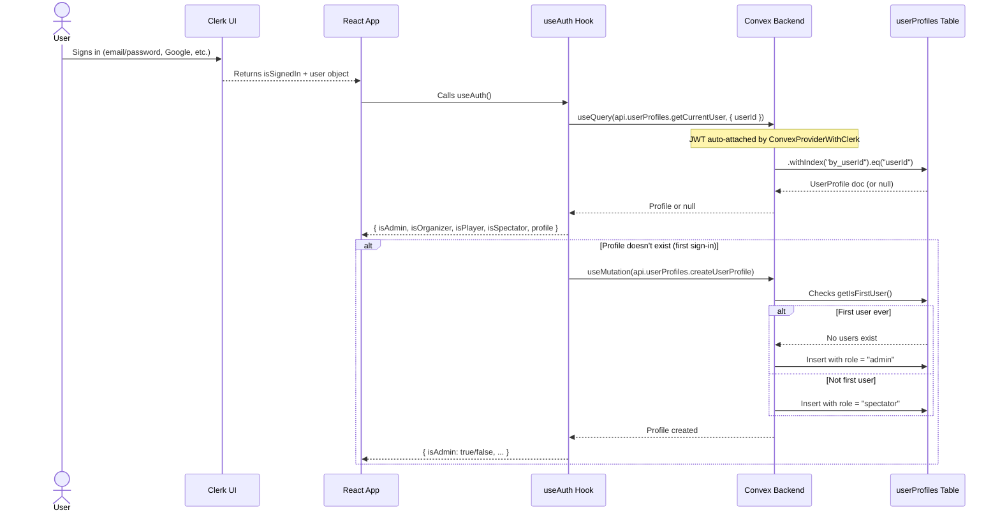

# Authentication & Role-Based Access Control

## Auth Flow



## Role Definitions

| Role | Level | Description |
|------|-------|-------------|
| `admin` | 4 (highest) | Full system access. Manage users, tournaments, teams, players, games, everything. |
| `organizer` | 3 | Tournament management. Can create/manage tournaments, schedule games, enter results. |
| `player` | 2 | Team participation. Can register teams, manage rosters, view schedules. |
| `spectator` | 1 (lowest) | Read-only. Can browse brackets, schedules, stats. Cannot create/edit/delete anything. |

## First-User-Admin Rule

From `convex/userProfiles.ts`:

```typescript
const existingUser = await ctx.db.query("userProfiles").first();
const isFirstUser = existingUser === null;
const role: Role = isFirstUser ? "admin" : "spectator";
```

- **First user** to sign up → auto-promoted to `admin`
- **Every subsequent user** → defaults to `spectator`
- Admins can change roles via `updateUserRole` mutation

## Permission Matrix

### Read (Query) Access

| Entity | Public (no sign-in) | Spectator | Player | Organizer | Admin |
|--------|---------------------|-----------|--------|-----------|-------|
| Tournaments | list, getById | ✓ | ✓ | ✓ | ✓ |
| Teams | list, count | ✓ | ✓ | ✓ | ✓ |
| Players | list, search, getById, countByTeam | ✓ | ✓ | ✓ | ✓ |
| Games | list, getByTournament, count | ✓ | ✓ | ✓ | ✓ |
| Fields | list, getByTournament, count | ✓ | ✓ | ✓ | ✓ |
| GameStats | getByGame, getByPlayer | ✓ | ✓ | ✓ | ✓ |
| PlayerStats | list, count | ✓ | ✓ | ✓ | ✓ |
| UserProfiles | getCurrentUser (self) | ✓ | ✓ | ✓ | ✓ |

All queries are **public** — no auth check on read operations. This supports the spectator use case (browsing without signing in).

### Write (Mutation) Access

| Mutation | Spectator | Player | Organizer | Admin |
|----------|-----------|--------|-----------|-------|
| Tournament create | ✗ | ✗ | ✓ | ✓ |
| Tournament update | ✗ | ✗ | ✓ | ✓ |
| Tournament delete | ✗ | ✗ | ✓ | ✓ |
| Team create | ✗ | ✓ | ✓ | ✓ |
| Team update | ✗ | ✓ | ✓ | ✓ |
| Team delete | ✗ | ✗ | ✓ | ✓ |
| Player create | ✗ | ✓ | ✓ | ✓ |
| Player update | ✗ | ✓ | ✓ | ✓ |
| Player delete | ✗ | ✗ | ✓ | ✓ |
| Player bulkAssign | ✗ | ✓ | ✓ | ✓ |
| Game create | ✗ | ✗ | ✓ | ✓ |
| Game update | ✗ | ✗ | ✓ | ✓ |
| Game delete | ✗ | ✗ | ✓ | ✓ |
| Field create | ✗ | ✗ | ✓ | ✓ |
| Field update | ✗ | ✗ | ✓ | ✓ |
| Field delete | ✗ | ✗ | ✓ | ✓ |
| GameStats upsert | ✗ | ✗ | ✓ | ✓ |
| UserProfile create (self) | ✓ | ✓ | ✓ | ✓ |
| UserRole update | ✗ | ✗ | ✗ | **Admin only** |

**Server-side enforcement**: Every mutation validates `ctx.auth.getUserIdentity()`. The `updateUserRole` mutation additionally checks `adminProfile.role !== "admin"`. All mutations return `401 Unauthorized` if the caller is not authenticated.

**Client-side enforcement**: `ProtectedRoute` component shows `AccessDeniedMessage` for unauthenticated or non-admin users. Tables hide edit/delete buttons when `isAdmin` is false.

## Client-Side: `useAuth()` Hook

**File**: [`src/hooks/useAuth.ts`](../src/hooks/useAuth.ts)

```typescript
const { isAdmin, isOrganizer, isPlayer, isSpectator, profile, isLoading } = useAuth();
```

| Return Field | Type | Description |
|-------------|------|-------------|
| `isLoaded` | `boolean` | Clerk auth state loaded |
| `isSignedIn` | `boolean` | User is authenticated |
| `user` | `UserResource \| null` | Clerk user object |
| `profile` | `UserProfile \| null` | Convex user profile (has role) |
| `isAdmin` | `boolean` | `profile.role === "admin"` |
| `isOrganizer` | `boolean` | `profile.role === "organizer"` |
| `isPlayer` | `boolean` | `profile.role === "player"` |
| `isSpectator` | `boolean` | `profile.role === "spectator"` |
| `isLoading` | `boolean` | True while auth or profile is loading |
| `hasError` | `boolean` | Profile creation failed |
| `error` | `Error \| null` | Error details |

**Auto-profile-creation**: On first sign-in for a Clerk user, the hook automatically calls `createUserProfile` once the Convex query returns `null`. Shows a toast on success/failure.

**Safe defaults**: When `VITE_CLERK_PUBLISHABLE_KEY` is not configured (CI, local dev without keys), returns a safe unauthenticated state so components still render.

## Client-Side: `ProtectedRoute` Component

**File**: [`src/components/ProtectedRoute.tsx`](../src/components/ProtectedRoute.tsx)

```tsx
<ProtectedRoute requireAdmin={true}>
  <AdminOnlyContent />
</ProtectedRoute>
```

| Prop | Default | Behavior |
|------|---------|----------|
| `requireAdmin` | `true` | If true, requires `isAdmin`. If false, just requires `isSignedIn`. |
| `fallback` | `undefined` | Custom JSX instead of default `AccessDeniedMessage` |

States:
- **Loading** → Spinner (`Loader2` centered)
- **Not signed in** → `AccessDeniedMessage` with "Authentication Required" + "Go Home" button
- **Signed in but not admin** (when `requireAdmin=true`) → `AccessDeniedMessage` with "Admin Access Required" + contact message
- **Authorized** → Renders children

## Server-Side: Auth Pattern

Every mutation follows:

```typescript
const identity = await ctx.auth.getUserIdentity();
if (!identity) throw new Error("Unauthorized");
```

For role-specific enforcement (e.g., admin-only):

```typescript
const adminProfile = await ctx.db
  .query("userProfiles")
  .withIndex("by_userId", (q) => q.eq("userId", identity.subject))
  .unique();

if (!adminProfile || adminProfile.role !== "admin") {
  throw new Error("Only admins can perform this action");
}
```

Currently, only `updateUserRole` enforces role-level checks beyond authentication. Other mutations check authentication only.
