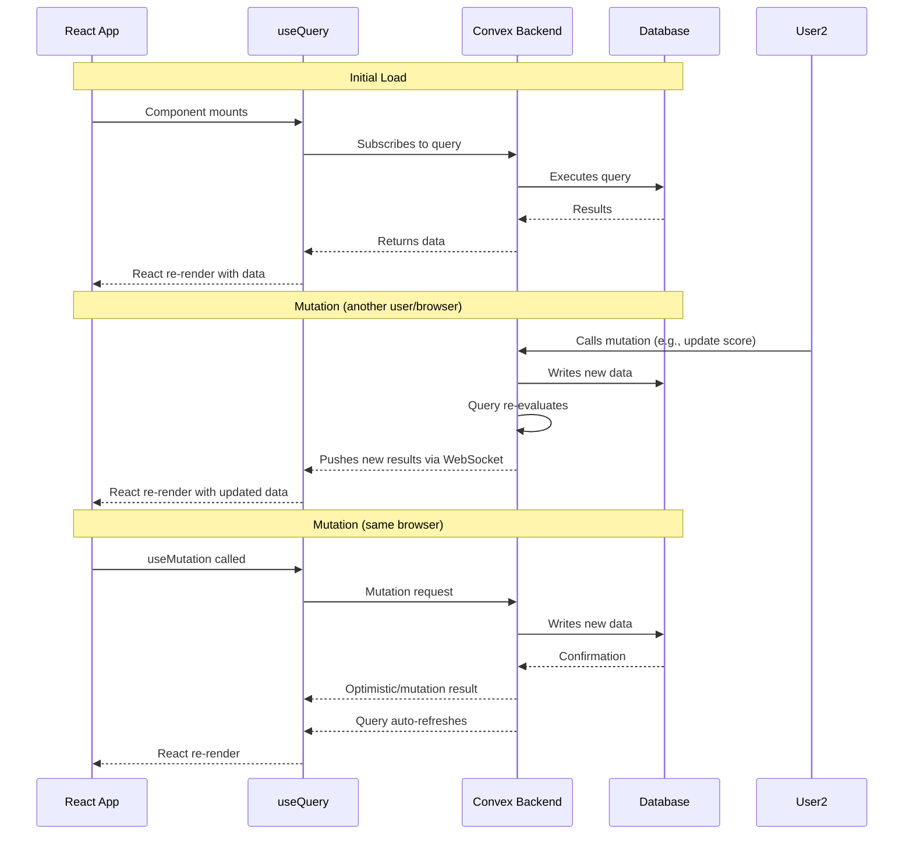

# Real-Time Updates with Convex

## How Convex Reactivity Works

Convex provides real-time data synchronization automatically. Unlike traditional REST APIs where you poll for changes, Convex pushes updates to connected clients via WebSocket.



## Key Concepts

### Automatic Subscriptions

When you call `useQuery(api.teams.list, options)`, Convex automatically:

1. Registers a subscription on the server
2. Executes the query function
3. Returns the result to the client
4. **Re-executes** the query whenever any document it read changes
5. Pushes the new result to the client

No manual cache invalidation, no polling, no WebSocket management.

### Example: Live Score Updates

```typescript
// In src/hooks/useGames.ts
export function useGamesByTournament(tournamentId: Id<"tournaments">) {
  // This subscription auto-updates when any game in the tournament changes
  return useQuery(api.games.getByTournament, { tournamentId }) as GameWithTeams[] | undefined;
}
```

When an organizer enters a score (calls `api.games.update`), every browser viewing that tournament's games list re-renders with the new score within milliseconds.

### Example: Live Bracket Updates

```typescript
// In Tournament Detail page
const games = useQuery(api.games.getByTournament, { tournamentId });
const teams = useQuery(api.teams.list, { filtering: { tournamentId } });

// Both queries auto-refresh. Bracket re-renders when scores change.
<BracketView bracketType={tournament.bracketType} games={games} />
```

## What Updates in Real-Time

| Data | Hook | Updates When |
|------|------|-------------|
| Teams list | `useTeams()` | Any team is created/updated/deleted |
| Players list | `usePlayers()` | Any player is created/updated/deleted |
| Games list | `useGames()` | Scores entered, status changed |
| Tournament list | `useTournaments()` | Tournament created/edited |
| Fields list | `useFields()` | Field added/modified/deleted |
| Game stats | `useGameStatsByGame()` | Stats entered for that game |
| Player stats | `usePlayerStats()` | Any game stats updated |
| Standings | (computed from games) | Re-renders when games change |
| Bracket | (computed from games) | Re-renders when games change |
| User profile | `useAuth()` | Profile created, role changed |

## Loading States

Convex subscriptions go through these states:

| State | `result` value | `isLoading` | What to show |
|-------|---------------|-------------|--------------|
| **Initial load** | `undefined` | `true` | Spinner / skeleton |
| **Data received** | Data array | `false` | Render content |
| **Empty result** | `[]` | `false` | Empty state message |
| **Not found** | `null` | `false` | "Not found" message |
| **Subscription error** | `undefined` (error thrown) | `false` | Error boundary / fallback |

Standard hook pattern:

```typescript
function MyComponent() {
  const { data, totalCount, isLoading } = useEntity();

  if (isLoading) return <LoadingSpinner />;
  if (data.length === 0) return <EmptyState />;

  return <DataTable data={data} totalCount={totalCount} />;
}
```

## Performance Considerations

### Current State: Full Table Scans

All queries currently use `.collect()` (full table scans) because only `userProfiles` has indexes. This is acceptable at small scale (< 1000 documents per table). As data grows, add indexes:

```typescript
// In convex/schema.ts — future optimization
games: defineTable({ ... })
  .index("by_tournamentId", ["tournamentId"])
  .index("by_status", ["status"]),
```

### Subscription Granularity

- Each `useQuery` call is a separate subscription
- The DataTable pattern (pagination + sorting + filtering) creates **one subscription per unique set of options**
- Changing page/sort/filter creates a **new subscription** (older one is cleaned up automatically)

### Optimistic Updates

Convex does not do automatic optimistic updates. If you want instant UI feedback during mutations:

```typescript
const createTeam = useMutation(api.teams.create);

// The team list will auto-refresh once the mutation completes
// (no manual cache update needed)
await createTeam({ tournamentId, name, ...data });
```

For immediate feedback before the mutation completes, you'd need an optimistic update layer (not yet implemented in this codebase).

## Debugging Real-Time Behavior

- Open browser DevTools → Network tab → WebSocket messages
- Convex dev server logs re-executed queries
- Use `npx convex dashboard` to view function execution logs

## Known Limitations

- No built-in optimistic updates for mutations
- Full table scans on 6 of 7 tables (performance degrades at scale)
- No debouncing on search input (fires subscription on every keystroke — acceptable via Convex's efficient re-evaluation)
