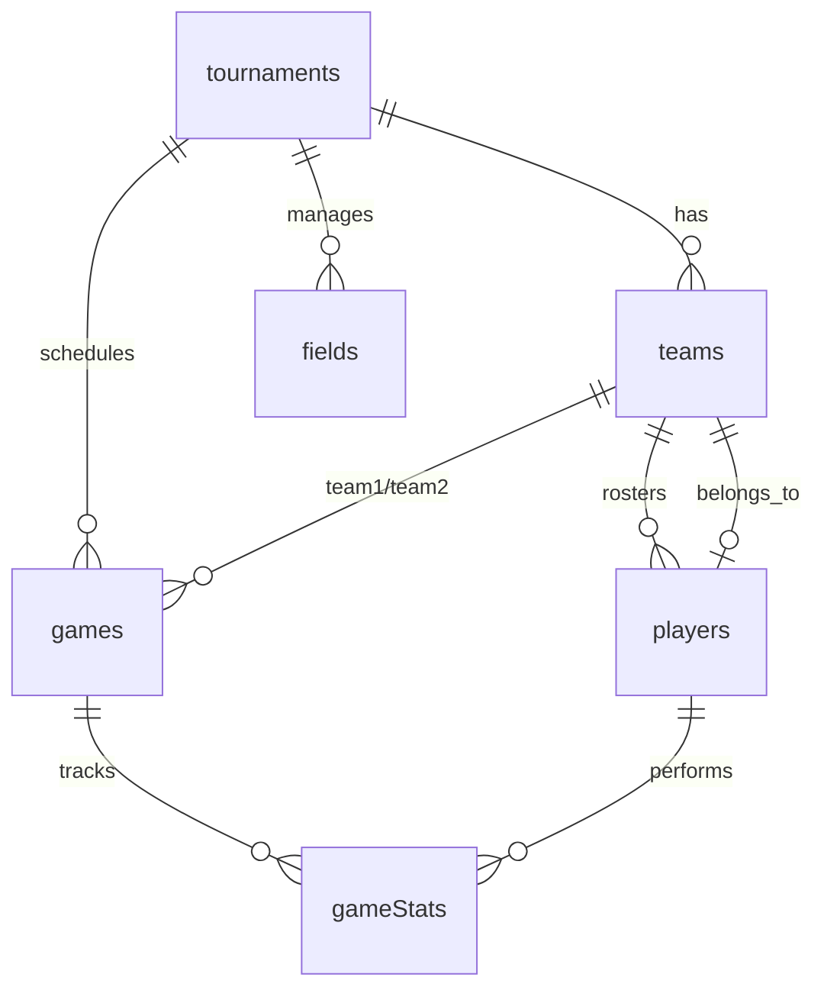

# Database Schema

## Entity-Relationship Diagram

## Table Reference

### tournaments

| Field | Type | Required | Notes |
|-------|------|----------|-------|
| `_id` | `Id<"tournaments">` | auto | System-generated |
| `_creationTime` | `number` | auto | Unix ms timestamp |
| `name` | `string` | yes | Tournament display name |
| `description` | `string?` | no | Optional description |
| `sport` | `string` | yes | e.g. "Softball" |
| `location` | `string` | yes | Venue / city |
| `startDate` | `number?` | no | Unix ms |
| `endDate` | `number?` | no | Unix ms |
| `registrationDeadline` | `number?` | no | Unix ms |
| `maxTeams` | `number` | yes | Max participants |
| `minTeams` | `number` | yes | Min to proceed |
| `currentTeamCount` | `number` | yes | Tracks registrations |
| `bracketType` | `enum` | yes | `single_elimination` / `double_elimination` / `round_robin` |
| `fieldsAvailable` | `number` | yes | Number of game fields |
| `gameDuration` | `number` | yes | Minutes per game |
| `breakBetweenGames` | `number` | yes | Minutes between games |
| `status` | `enum` | yes | `draft` / `registration_open` / `registration_closed` / `active` / `complete` |
| `organizerId` | `string` | yes | Clerk user ID of creator |
| `seedingType` | `enum` | yes | `random` / `manual` / `ranking` |
| `gameFormatRules` | `any?` | no | Sport-specific rules |
| `createdAt` | `number?` | no | Unix ms |
| `updatedAt` | `number?` | no | Unix ms |

**Indexes**: None (full table scan)

---

### teams

| Field | Type | Required | Notes |
|-------|------|----------|-------|
| `_id` | `Id<"teams">` | auto | System-generated |
| `_creationTime` | `number` | auto | Unix ms timestamp |
| `tournamentId` | `Id<"tournaments">` | yes | FK → tournaments |
| `name` | `string` | yes | Team name |
| `description` | `string?` | no | Optional |
| `coachName` | `string` | yes | Head coach |
| `coachEmail` | `string` | yes | Contact email |
| `coachPhone` | `string` | yes | Contact phone |
| `city` | `string?` | no | Home city |
| `homeField` | `string?` | no | Home field name |
| `organization` | `string?` | no | Parent org |
| `teamAgeGroup` | `string?` | no | e.g. "U14" |
| `status` | `enum` | yes | `active` / `inactive` / `suspended` |
| `captainPlayerId` | `Id<"players">?` | no | FK → players |
| `createdAt` | `number` | yes | Unix ms |
| `updatedAt` | `number` | yes | Unix ms |

**Indexes**: None (full table scan)

---

### players

| Field | Type | Required | Notes |
|-------|------|----------|-------|
| `_id` | `Id<"players">` | auto | System-generated |
| `_creationTime` | `number` | auto | Unix ms timestamp |
| `userId` | `string?` | no | Clerk user ID if registered |
| `teamId` | `Id<"teams">?` | no | FK → teams |
| `firstName` | `string` | yes | |
| `lastName` | `string` | yes | |
| `jerseyNumber` | `number?` | no | |
| `email` | `string?` | no | |
| `phone` | `string?` | no | |
| `birthDate` | `number?` | no | Unix ms |
| `isCaptain` | `boolean` | yes | Whether player is team captain |
| `status` | `enum` | yes | `active` / `inactive` / `injured` |
| `createdAt` | `number` | yes | Unix ms |
| `updatedAt` | `number` | yes | Unix ms |

**Indexes**: None (full table scan)

---

### games

| Field | Type | Required | Notes |
|-------|------|----------|-------|
| `_id` | `Id<"games">` | auto | System-generated |
| `_creationTime` | `number` | auto | Unix ms timestamp |
| `tournamentId` | `Id<"tournaments">` | yes | FK → tournaments |
| `round` | `number` | yes | 1=quarterfinals, 2=semis, 3=finals |
| `gameNumber` | `number` | yes | Position in bracket |
| `team1Id` | `Id<"teams">` | yes | FK → teams |
| `team2Id` | `Id<"teams">` | yes | FK → teams |
| `winnerId` | `Id<"teams">?` | no | FK → teams |
| `scheduledTime` | `number?` | no | Unix ms |
| `actualStartTime` | `number?` | no | Unix ms |
| `actualEndTime` | `number?` | no | Unix ms |
| `fieldId` | `Id<"fields">?` | no | FK → fields |
| `team1Score` | `number?` | no | |
| `team2Score` | `number?` | no | |
| `status` | `enum` | yes | `scheduled` / `in_progress` / `completed` / `postponed` / `cancelled` |

**Indexes**: None (full table scan)

---

### fields

| Field | Type | Required | Notes |
|-------|------|----------|-------|
| `_id` | `Id<"fields">` | auto | System-generated |
| `_creationTime` | `number` | auto | Unix ms timestamp |
| `tournamentId` | `Id<"tournaments">` | yes | FK → tournaments |
| `name` | `string` | yes | Field name/number |
| `location` | `string?` | no | Specific location |
| `status` | `enum` | yes | `available` / `maintenance` / `unavailable` |

**Indexes**: None (full table scan)

---

### gameStats

| Field | Type | Required | Notes |
|-------|------|----------|-------|
| `_id` | `Id<"gameStats">` | auto | System-generated |
| `_creationTime` | `number` | auto | Unix ms timestamp |
| `gameId` | `Id<"games">` | yes | FK → games |
| `playerId` | `Id<"players">` | yes | FK → players |
| `sportType` | `string?` | no | Extensibility for multi-sport |
| `gamesPlayed` | `number` | yes | |
| `atBats` | `number` | yes | |
| `hits` | `number` | yes | |
| `singles` | `number` | yes | |
| `doubles` | `number` | yes | |
| `triples` | `number` | yes | |
| `homeRuns` | `number` | yes | |
| `rbi` | `number` | yes | Runs batted in |

**Indexes**: None (full table scan)

---

### userProfiles

| Field | Type | Required | Notes |
|-------|------|----------|-------|
| `_id` | `Id<"userProfiles">` | auto | System-generated |
| `_creationTime` | `number` | auto | Unix ms timestamp |
| `userId` | `string` | yes | Clerk user ID (unique) |
| `role` | `enum` | yes | `admin` / `organizer` / `player` / `spectator` |
| `displayName` | `string?` | no | |
| `email` | `string?` | no | |

**Indexes**:
- `by_userId` on `userId` — used in `getCurrentUser`, `getUserRole`, `createUserProfile`
- `by_role` on `role` — available for admin queries

## Index Status

Only `userProfiles` has indexes. All other tables perform full table scans (acceptable at small scale — revisit when data grows).

## Foreign Key Relationships

| Source | FK Field | Target | Type |
|--------|----------|--------|------|
| teams | tournamentId | tournaments | Required |
| players | teamId | teams | Optional |
| games | tournamentId | tournaments | Required |
| games | team1Id, team2Id | teams | Required |
| games | winnerId | teams | Optional |
| games | fieldId | fields | Optional |
| gameStats | gameId | games | Required |
| gameStats | playerId | players | Required |
| teams | captainPlayerId | players | Optional |
