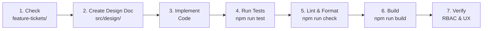

# Development Workflow

## Feature Development Lifecycle



### Step 1: Planning

- Check `feature-tickets/` for related tickets
- Review [MVP_ROADMAP.md](../feature-tickets/MVP_ROADMAP.md) for dependency order
- Check `backlog/` for deferred work
- Review `complete/` for previously implemented patterns

**Ticket files are structured as**:
- `# Title` — feature description
- `## Dependencies` — prerequisite tickets
- `## Implementation` — files to create/modify
- `## Acceptance Criteria` — checklist for done
- `## Design Notes` — relevant patterns

### Step 2: Design Document

If adding a new route, create a design doc at `src/design/<ROUTE_NAME>_DESIGN.md`:

```
1. Overview — goals and user needs
2. ASCII wireframe — visual layout sketch
3. Component breakdown — what components are needed
4. Technical notes — shadcn components, Tailwind classes
5. Responsive behavior — mobile/tablet/desktop
6. Phases — implementation priority order
```

See [TABLES_DESIGN.md](../src/design/TABLES_DESIGN.md) as a reference.

### Step 3: Implementation

Order of work:

1. **Convex backend** — schema changes → queries → mutations
2. **Custom hooks** — wrap Convex queries in `src/hooks/`
3. **Components** — build UI components
4. **Routes** — wire everything together in `src/routes/`

### Step 4: Testing

```bash
npm run test                # Run all unit tests
npm run test <path>         # Run specific test
npm run test:watch          # Watch mode
npm run test:e2e            # E2E tests (requires dev server)
```

### Step 5: Lint & Format

```bash
npm run check     # Format + lint check (must pass before commit)
npm run format    # Auto-format all files
npm run lint      # Lint check only
```

**Biome rules**:
- Tab indentation
- Double quotes
- Imports organized automatically
- `routeTree.gen.ts` and `styles.css` are excluded

### Step 6: Build

```bash
npm run build
```

Verify no build errors. Output goes to `dist/client/`.

### Step 7: RBAC & UX Verification

Before considering done:

- [ ] Do unauthenticated users see the right content?
- [ ] Do spectators see read-only views with appropriate banners?
- [ ] Do admins have edit/delete actions visible?
- [ ] Do mutations validate auth server-side?
- [ ] Are empty states, loading states, and error states handled?
- [ ] Does the feature respect the current role permission matrix?

## File Organization Conventions

### Import Order

1. External libraries (React, TanStack, Convex, etc.)
2. Internal `@/` alias modules
3. Relative imports

```typescript
import { useQuery } from "convex/react";
import { useState } from "react";
import { useAuth } from "@/hooks/useAuth";
import { Button } from "@/components/ui/button";
import { api } from "../../convex/_generated/api";
```

### Naming

| Entity | Convention | Example |
|--------|------------|---------|
| Components | PascalCase.tsx | `TeamCard.tsx`, `PlayersTable.tsx` |
| Hooks | camelCase.ts | `useTeams.ts`, `useAuth.ts` |
| Routes | `createFileRoute` | `index.tsx`, `teams.tsx` |
| Variables | camelCase | `totalCount`, `isLoading` |
| Constants | UPPER_SNAKE_CASE | `STATUS_FILTERS` |
| Types/Interfaces | PascalCase | `TeamListOptions`, `PlayerWithTeam` |

### Components

- Functional components with hooks
- Props typed via interfaces
- Destructure props
- Single responsibility — one component, one job

## Feature Ticket System

The project uses a ticket-based workflow in `feature-tickets/`:

```
feature-tickets/
  MVP_ROADMAP.md              # Master roadmap with dependency graph
  XX-feature-name.md          # Active tickets (numbered by priority)
  backlog/                    # Deferred / nice-to-have
    XX-feature-name.md
  complete/                   # Implemented tickets
    XX-feature-name.md
  auth-implementation/        # Auth-specific sub-tickets
    XX-feature-name.md
```

### Reading a Ticket

Tickets are markdown files with:

```markdown
# Feature Title

## Dependencies
- #06-crud-mutations.md (must be done first)

## Implementation
### Files to Modify
- `convex/players.ts` — add create/update/remove mutations
- `src/components/PlayerDialog.tsx` — wire mutation calls
- `src/components/PlayersTable.tsx` — add edit/delete handlers

## Acceptance Criteria
- [ ] Click "Add Player" opens dialog
- [ ] Filling form creates player in database
- [ ] Toast confirms success
- [ ] Table refreshes automatically
```

## Development Commands Quick Reference

| Command | When to Use |
|---------|-------------|
| `npm run dev` | Start local development |
| `npx convex dev` | Start Convex backend (second terminal) |
| `npx convex seed` | Load test data |
| `npm run test` | Run unit tests after changes |
| `npm run check` | Before committing |
| `npm run build` | Before pushing / deploying |
| `bunx shadcn@latest add` | Add new UI component |
