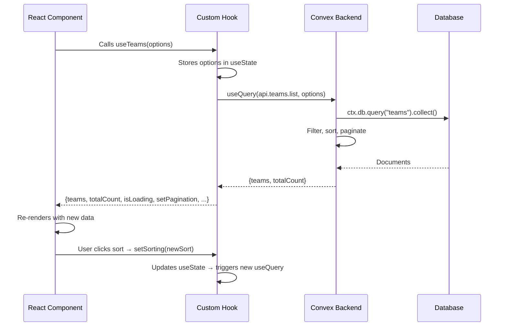

# Data Fetching Pattern

## The Consistent Hook Pattern

Every entity uses the same pattern. All hooks live in `src/hooks/` and follow this structure:

### Data Flow



### Hook Interface (example: `useTeams`)

**File**: [`src/hooks/useTeams.ts`](../src/hooks/useTeams.ts)

```typescript
function useTeams(initialOptions?: TeamListOptions) {
  // Internal state for pagination, sorting, filtering
  const [currentOptions, setCurrentOptions] = useState<TeamListOptions>(...);

  // Reactive Convex query — auto-refetches when options change
  const result = useQuery(api.teams.list, currentOptions);

  // Derive loading state from query result
  const teams = result?.teams || [];
  const totalCount = result?.totalCount || 0;
  const isLoading = result === undefined;

  // Memoized setter callbacks for components
  const setPagination = useCallback(...);
  const setSorting = useCallback(...);
  const setFiltering = useCallback(...);

  return { teams, totalCount, isLoading, setPagination, setSorting, setFiltering, currentOptions };
}
```

### Shared Interface

Every entity hook returns this shape:

| Return Field | Type | Description |
|-------------|------|-------------|
| `data[]` | `Entity[]` | Array of entities for current page |
| `totalCount` | `number` | Total matching before pagination |
| `isLoading` | `boolean` | `true` while Convex query is undefined |
| `setPagination` | `(p) => void` | Update page index/size |
| `setSorting` | `(s) => void` | Update sort field/direction |
| `setFiltering` | `(f) => void` | Update filter criteria |
| `currentOptions` | `Options` | Current query params (for debug) |

### Entity Hooks

| Hook | File | Backend Query | Special Features |
|------|------|---------------|------------------|
| `useTeams` | `src/hooks/useTeams.ts` | `api.teams.list` | playerCount join |
| `usePlayers` | `src/hooks/usePlayers.ts` | `api.players.list` | Also exports `usePlayerById`, `usePlayerSearch`, `usePlayerCount` |
| `useGames` | `src/hooks/useGames.ts` | `api.games.list` | Also exports `useGameList`, `useGamesByTournament`, `useGameMutations`, `GameWithTeams` type |
| `useTournaments` | `src/hooks/useTournaments.ts` | `api.tournaments.list` | Also exports `useTournamentById`, `useTournamentCount` |
| `usePlayerStats` | `src/hooks/usePlayerStats.ts` | `api.playerStats.list` | Computed `battingAverage` per player |
| `useFields` | `src/hooks/useFields.ts` | `api.fields.list` | Field-specific filtering |
| `useGameStats` | `src/hooks/useGameStats.ts` | `api.gameStats.getByGame` | Per-game stat lookup |
| `useSeasonGames` | `src/hooks/useSeasonGames.ts` | `api.seasonGames.listBySeason` | Returns games with homeTeam/awayTeam populated |

### Pagination, Sorting, Filtering Options

```typescript
interface EntityListOptions {
  pagination?: {
    pageIndex: number;  // 0-indexed
    pageSize: number;    // items per page
  };
  sorting?: {
    field: string;       // entity field name
    direction: "asc" | "desc";
  };
  filtering?: {
    search?: string;     // text search (name, email, etc.)
    status?: string[];   // status enum filter
    tournamentId?: Id<"tournaments">;  // FK filter
    // + entity-specific filters
  };
}
```

### Backend Query Pattern (Convex side)

**File**: [`convex/teams.ts`](../convex/teams.ts)

```typescript
export const list = query({
  args: { pagination, sorting, filtering },
  handler: async (ctx, args) => {
    // 1. Fetch all (no index yet — full table scan)
    let teams = await ctx.db.query("teams").collect();

    // 2. Apply filters in memory
    if (args.filtering?.tournamentId) teams = teams.filter(...);
    if (args.filtering?.search) teams = teams.filter(...);
    if (args.filtering?.status) teams = teams.filter(...);

    // 3. Apply sorting
    if (args.sorting) teams.sort(...);

    // 4. Count before pagination
    const totalCount = teams.length;

    // 5. Join related data (e.g., player counts)
    // 6. Apply pagination slice
    return { teams, totalCount };
  },
});
```

### Loading State Convention

- `result === undefined` → **Loading** (Convex hasn't returned yet)
- `result === null` → **Not Found** (specific queries like `getById`)
- `result.data.length === 0` → **Empty** (no matching entities)

Components check for `isLoading` and render spinners or empty states accordingly.

### Mutations

Mutations use Convex's `useMutation` and are called imperatively:

```typescript
const createTeam = useMutation(api.teams.create);

const handleSubmit = async (data: TeamFormData) => {
  try {
    await createTeam({ tournamentId, ...data });
    toast.success("Team created");
  } catch (err) {
    toast.error("Failed to create team");
  }
};
```

Mutations are organized in entity-specific hooks like `useGameMutations`:
- `useGameMutations` → `{ createGame, updateGame, removeGame }`
