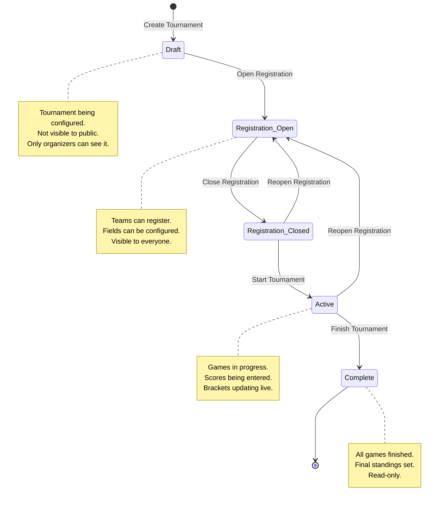

# Tournament Lifecycle

## Overview

Every tournament goes through a defined lifecycle of states. The state determines what actions are available and what users can see.



## State Details

### 1. Draft

The tournament is being created. Only organizers/admins can see and edit it.

**Available actions**:
- Edit name, sport, location, dates
- Configure bracket type and seeding
- Set field count and game duration
- Set team limits (min/max)
- Edit tournament settings

**UI**: Tournament card shows "Draft" badge. Edit button available.

---

### 2. Registration Open

Teams can now register. The tournament is visible to everyone.

**Available actions**:
- All Draft actions still available
- Organizers can add teams
- Players can register teams (if they have Player role or higher)
- Admin can close registration early

**UI**: Tournament card shows "Registration Open" badge. "Register Team" button available.

---

### 3. Registration Closed

Team registration is locked. Rosters are frozen.

**Available actions**:
- Schedule games and assign fields
- Generate bracket
- Cannot add or remove teams (except by admin override)

**UI**: Tournament card shows "Registration Closed" badge.

---

### 4. Active

The tournament is running. Games are being played.

**Available actions**:
- Enter game scores
- Update game status (scheduled → in_progress → completed)
- View live bracket updates
- View standings (auto-calculated)
- Postpone or cancel games

**UI**: Tournament card shows "Active" badge. Score entry fields available. Bracket shows in-progress games.

---

### 5. Complete

All games are finished. Results are final.

**Available actions**:
- View final standings
- View completed bracket
- View player statistics
- No edits allowed (read-only)

**UI**: Tournament card shows "Complete" badge. All data is read-only.

## State Transitions

| From | To | Who Can Do It | Notes |
|------|-----|---------------|-------|
| Draft | Registration Open | Organizer/Admin | Tournament becomes public |
| Registration Open | Registration Closed | Organizer/Admin | Can also auto-close at deadline |
| Registration Open | Draft | Organizer/Admin | Go back to edit |
| Registration Closed | Registration Open | Organizer/Admin | Reopen if needed |
| Registration Closed | Active | Organizer/Admin | Start the tournament |
| Active | Complete | Organizer/Admin | All games finished |
| Active | (no revert) | — | Cannot go back from Active |

## Game Status Lifecycle

Each game within a tournament has its own lifecycle:

```
Scheduled → In Progress → Completed
                  ↓
            Postponed → Scheduled (rescheduled)
            Cancelled (terminal)
```

- **Scheduled**: Game has a time and field assigned
- **In Progress**: Game is currently being played
- **Completed**: Final score entered, winner recorded
- **Postponed**: Moved to a later time (returns to Scheduled)
- **Cancelled**: Game will not be played (terminal state)

## Related Documentation

- [User Flows](USER_FLOWS.md) — Step-by-step walkthroughs for each role
- [Roles & Permissions](ROLES_AND_PERMISSIONS.md) — What each role can do
- [Glossary](GLOSSARY.md) — Tournament terminology
